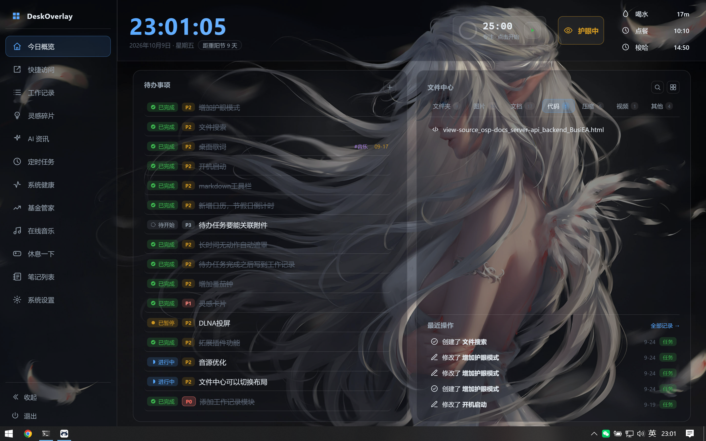
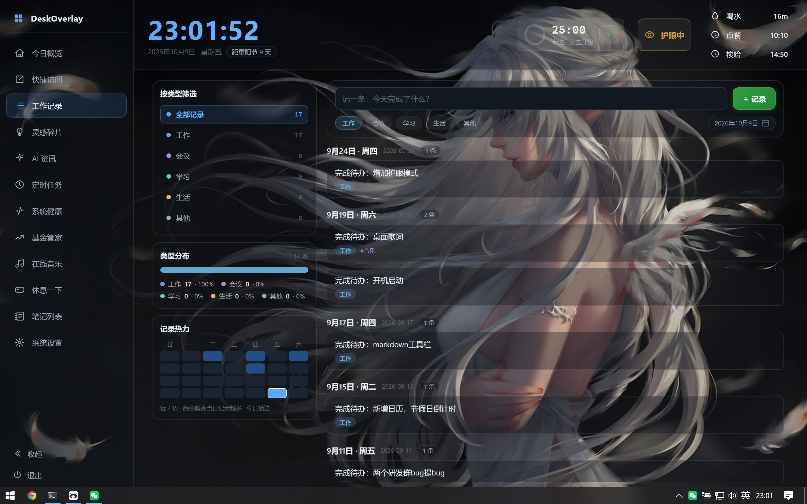
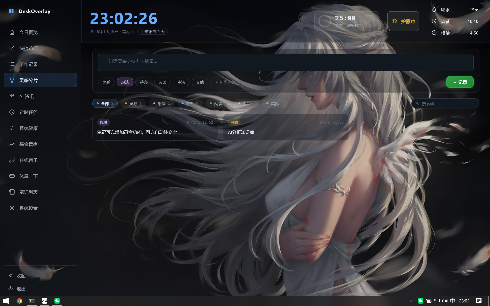
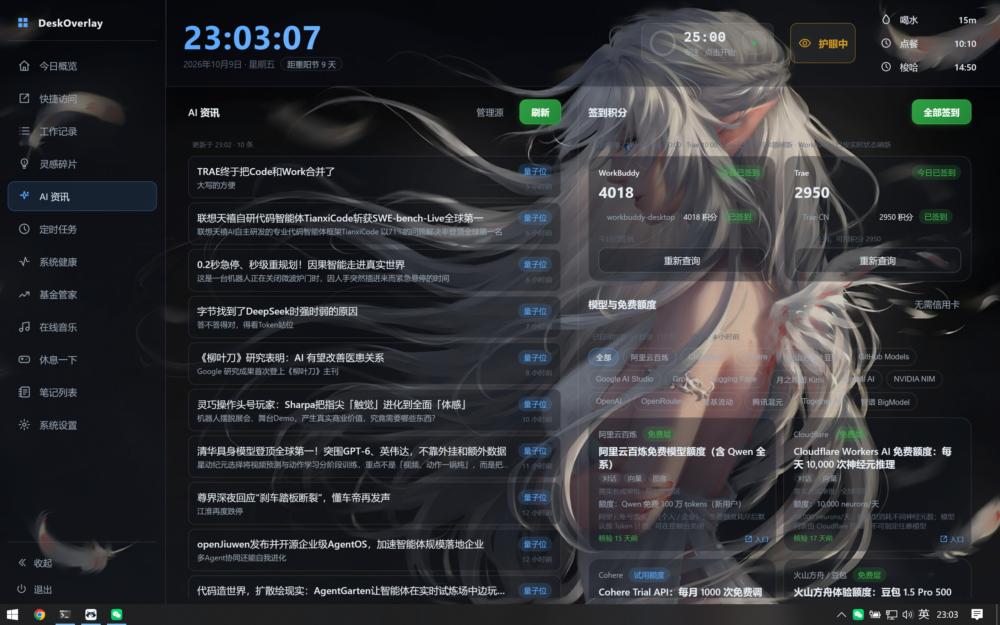
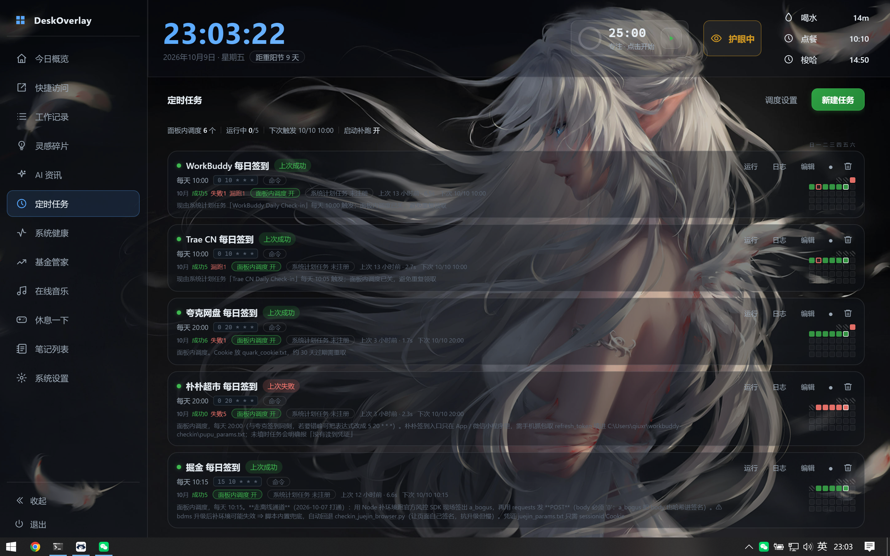
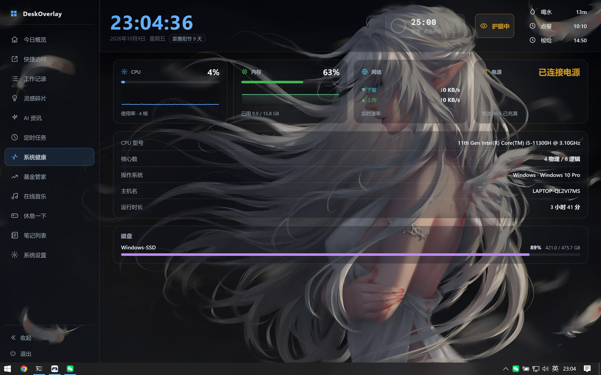
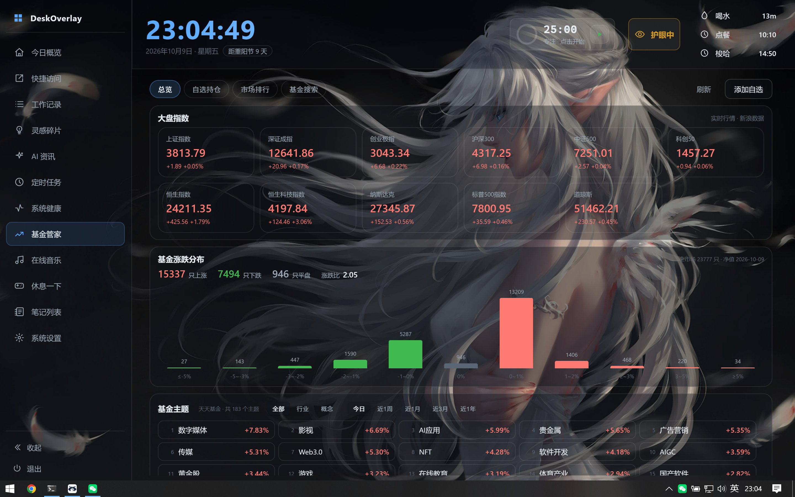
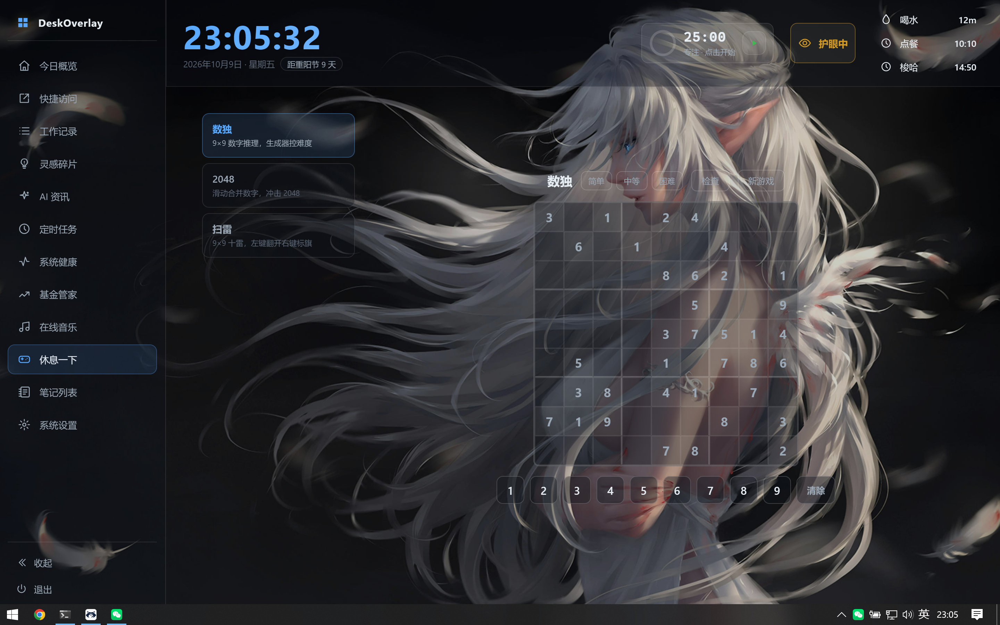
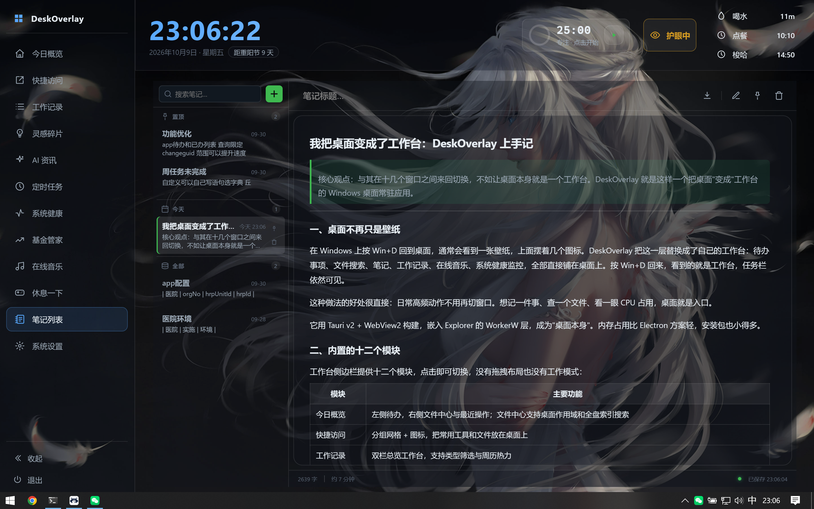
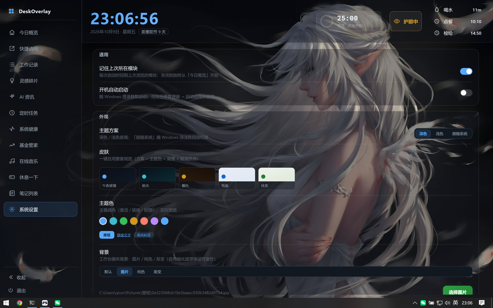

# DeskOverlay

Windows 桌面工作台（Tauri v2 + WebView2）。应用嵌入 Explorer 桌面 WorkerW，使工作台成为「桌面本身」——Win+D 回到工作台，任务栏仍可见。

**内置模块（12 个，侧边导航 + 单模块切换，无拖拽 / 无工作模式）**

| 模块 | 内容 |
| --- | --- |
| 今日概览 | 待办事项（左）+ 文件中心 / 最近操作（右），文件中心支持桌面作用域与全盘索引搜索 |
| 快捷访问 | 分组网格 + 图标 |
| 工作记录 | 双栏总览工作台（类型筛选 + 周历热力） |
| 灵感碎片 | 随手记入口 + 卡片墙（JS 瀑布流）+ 自定义标签 |
| AI 资讯 | 资讯聚合（HF Papers / 机器之心 / 量子位，源可增删）+ 模型免费额度目录 + 签到积分（WorkBuddy / Trae 自动打卡） |
| 定时任务 | 任务列表 + 可视化编辑器 + 实时日志 + 运行历史 + 导出为 Windows 计划任务 |
| 系统健康 | CPU / 内存 / 磁盘 / 网络 / 电源实时采样与趋势 |
| 基金管家 | 总览 / 自选持仓 / 市场排行 / 基金搜索；持仓账本 + 当日估值（重仓股拟合 + 精度自校准）+ AI 分析（SSE 流式） |
| 在线音乐 | 多音源在线搜索、阿里云盘、下载与队列、歌单、桌面歌词 |
| 休息一下 | 扫雷 / 2048 / 数独 |
| 笔记列表 | Markdown 编辑 / 预览双态、置顶分组、导出 .md |
| 系统设置 | 通用、外观（主题方案 / 皮肤 / 主题色）、插件、隐私、护眼、备份与恢复 |

**常驻能力**

- 时钟条上的**番茄钟胶囊**与**护眼色温胶囊**（点击开关，右键 / 点击展开浮层）
- 时钟条**日期药丸**：农历节日 / 二十四节气 / 法定假期与调休补班（纯前端推算，零依赖零网络）
- 提醒：每日定时 / 间隔 / 久坐 / 喝水，均为系统级置顶窗口且**不抢键盘焦点**
- 隐私锁屏：空闲自动触发，Tauri 下使用独立的系统级置顶星空窗口
- 桌面歌词条：独立置顶窗口，单行 / 双行、描边 / 胶囊 / 加粗、对齐、字号、自定义配色、时间偏移
- 快速指令条：`Ctrl/Cmd + Space`
- **可扩展架构：外部 .zip 插件包**，前端与（可选）Rust→wasm 后端都在插件包内，导入即用

---

## 界面预览

| | |
| --- | --- |
| **今日概览**<br> | **快捷访问**<br> |
| **工作记录**<br> | **灵感碎片**<br> |
| **AI 资讯**<br> | **定时任务**<br> |
| **系统健康**<br> | **基金管家**<br> |
| **在线音乐**<br> | **休息一下**<br> |
| **笔记列表**<br> | **系统设置**<br> |

---

## 一、运行 / 开发

环境要求：Rust（含 `cargo` + `tauri-cli`）、Node.js（仅前端开发态静态服务器与校验脚本用）。

```bash
cd src-tauri
cargo tauri dev
```

`beforeDevCommand` 会自动执行 `node ../frontend/serve.js`，在 1420 端口提供 `frontend/web` 静态资源（`devUrl: http://localhost:1420`）。前端是**原生 ESM、无打包器**——改完刷新即可，不需要构建步骤。

只想看前端（不进 Tauri 运行时）：

```bash
cd frontend && node serve.js    # 然后访问 http://localhost:1420
```

此时 `window.__TAURI__` 不存在，`js/bus.js` 会自动回退到 Bus 模拟，界面可点但后端命令无效。

### 目录结构

```
frontend/
  serve.js                # 零依赖静态服务器（1420）
  web/                    # 打包进应用的静态资源（frontendDist）
    index.html            # 主窗口
    reminder.html         # 提醒窗口
    lyric.html            # 桌面歌词条
    lyric-menu.html       # 歌词设置弹窗
    lock.html             # 隐私锁屏
    js/                   # 原生 ESM 模块
      app.js views.js     # 启动装配 + 模块注册与切换
      bus.js              # invoke / listen 解耦层：Tauri 态走 IPC，dev 态走 Bus 模拟
      state.js store.js   # 状态与持久化（saveState 300ms 防抖合并写入）
      config.js           # 模块定义与跨端常量（签到结果目录等）
      theme.js            # 主题运行时（纯函数计算 CSS 变量，锁屏/提醒窗口复用）
      utils.js icons.js   # 共用小工具与线性 SVG 图标
      festivals.js        # 农历 / 节气 / 法定假期（纯前端推算，零依赖零网络）
      tasks.js quickAccess.js     # 待办、快捷访问的数据模型
      eyeCare.js eyeCareCapsule.js pomodoro.js  # 护眼（逻辑 + 胶囊）与番茄钟
      lock.js lockpage.js lockScene.js          # 锁屏（空闲监测 + 独立窗口 + 共用星空渲染器）
      lyric.js lyric-menu.js      # 桌面歌词条与设置弹窗
      reminder.js reminders.js    # 提醒窗口页与提醒队列
      commandbar.js plugins.js providers.js     # 指令条 / 插件加载 / 在线音源
      datepicker.js selectbox.js toast.js       # 通用 UI 组件
      views/              # 各模块视图（views.js 负责注册与切换）
    css/style.css         # 全量样式（含全部窗口）
src-tauri/
  src/
    main.rs               # 命令编排、窗口生命周期、歌词/提醒/锁屏调度
    scheduler.rs          # 定时任务：20s tick 调度线程 + 运行历史落盘
    scheduler_export.rs   # 导出为 Windows 计划任务（.cmd 包装脚本 + schtasks）
    checkin.rs            # 签到登录态收集（只读客户端本地文件，解密在前端）
    file_index.rs         # 全盘文件名索引（后台遍历固定盘，快照落盘 fileindex.txt）
    usn_index.rs          # 更快的 USN/$MFT 直读索引；读卷失败（未提权 / 非 NTFS）时回退 file_index
    sys_bridge.rs         # 系统采样（CPU / 内存 / 磁盘 / 网络 / 电源 / 空闲）
    eyecare.rs            # 护眼色温：时段算法 + 显示器色彩调整与守护线程
    sedentary.rs          # 久坐检测
    desktop_inject.rs     # 注入 Explorer WorkerW，成为「桌面本身」
    aliyundrive.rs        # 阿里云盘
    downloader.rs         # 下载与队列
    http.rs               # 共享 HTTP 传输层（ureq Agent 连接池）
    wasm_plugin.rs        # 插件 wasm 运行时（wasmi 沙箱）
    plugin_pkg.rs         # 插件包安装（解压 / manifest / 可选 cargo 编译）
    autostart.rs          # 开机自启
  examples/eyecare_probe.rs  # 护眼读写探测（非测试套件，按需手动跑）
tools/                    # 校验脚本（见下节）+ 冒烟用的假后端 smoke-mock.js
frontend/STYLE_GUIDE.md   # 视觉规范
docs/screenshots/         # README 界面预览图（每模块一张）
```

### 架构约定（新增代码前先读）

1. **所有后端能力走 `bus.js` 的 `invoke()`**：不要直接摸 `window.__TAURI__.core.invoke`。`invoke` 在真实 Tauri 态失败会**抛升**（不静默降级），浏览器 dev 态才回退到 Bus 模拟。
2. **`state.json` 只有主窗口是写者**。歌词页 / 提醒页 / 锁屏页都是整体覆盖写且只持有启动时的旧快照，它们的改动必须 `emit` 回主窗口落盘。
3. **命令名与 DOM id 是裸字符串契约**，重命名后没有编译期报错——改完必须跑 `tools/contract-check.mjs`。
4. **全盘索引是「懒加载 + 扁平存储」**（`file_index.rs`）：`setup()` 只调 `prime()` 登记数据目录；读快照 / 建索引推迟到**首次全盘搜索**。

   - `IndexInner` 的 `paths` 与 `names` 必须成对更新；`FlatIndex::offs` 长度恒为「条数 + 1」，首项恒为 0。
   - 路径按全路径字典序排列，因此搜索结果是字典序（前端不排序）。
5. **定时任务是「两端各管一段，避免双份真相」**（`scheduler.rs`）：任务定义由前端独占写 `state.json` 的 `scheduler.tasks`，Rust 每 20s 读该文件判定到期；运行历史由 Rust 独占写 `scheduler-store.json`，前端只能经命令读。所以编辑任务**无需通知后端、保存即生效**，但历史不能从 state 里读。

### 数据持久化

全部落在 `app_data_dir`（`%APPDATA%/com.deskoverlay.desktop/`）：

- `state.json` —— 主状态（设置 / 待办 / 笔记元信息 / 灵感 / 导航态 / 定时任务定义 / AI 与基金数据等）
- `music.json`、`worklogs.json`、`notes.json` —— 音乐、工作记录、笔记正文（体量大，从 state.json 拆出）
- `scheduler-store.json` —— 定时任务的运行历史与下次触发时刻（**Rust 独占写**，前端只经命令读）
- `scheduler-logs/` —— 由「系统计划任务」触发时，包装脚本落的日志
- `fileindex.txt` —— 全盘索引快照（下次启动秒恢复；可重建，**不进备份**）
- `eyecare_baseline.json` —— 护眼 gamma 基准（丢了重新学习即可，不进备份）
- `plugins/<id>/` —— 解压后的插件包（**进备份**：插件靠目录扫描发现，不在 state 里）
- `wallpaper_cache/`、`music/`、`aliyundrive/` —— 壁纸缓存、音乐文件、云盘授权（不进备份，授权会过期）

签到结果另放在**仓库内的** `.workbuddy/checkin-logs/`（该目录已 gitignore，不会污染仓库）；路径常量在 `js/config.js` 的 `CHECKIN_RESULT_DIR`，脚本侧 `checkin_paths.py` 有一份对应物，改路径必须两边同时改。

「系统设置 → 备份与恢复」按上述白名单打包为 zip 导出 / 导入。恢复后需再调一次 `scheduler_reload_store`，否则调度器的内存副本会静默写回旧历史。

### 快捷键

| 按键 | 行为 |
| --- | --- |
| `Ctrl/Cmd + Space` | 打开 / 关闭快速指令条 |
| `↑` `↓` `Enter` | 指令条内移动选择 / 执行 |
| `Esc` | 关闭当前浮层（帮助层 / 指令条 / 各弹窗）；**不会退出应用** |
| `Ctrl/Cmd + Enter` | 各弹窗内提交（新建待办 / 灵感 / 快捷访问） |

---

## 二、校验

改动后按顺序跑完这几项即视为通过（退出码非 0 即失败）：

```bash
cargo check                     # src-tauri 下执行：编译 + 必须 0 warning
cargo test                      # src-tauri 下执行：纯函数单测（编码判定 / cron / 索引扁平化 / 输出缓冲上界）
node tools/contract-check.mjs   # 契约：命令 / DOM id / 事件名
node tools/eyecare-p1-check.mjs # 护眼前端接线
node tools/eyecare-schedule-check.mjs  # 护眼时段纯函数（跨午夜 / 过渡 / 边界）
node tools/smoke.mjs            # 真浏览器冒烟（headless Chrome + CDP）
```

| 脚本 | 覆盖 | 基线结果 |
| --- | --- | --- |
| `cargo test` | `file_index` 扁平索引不变量（字典序 / 偏移表 / 目录位图 / 两条扫描趟不重复）、`scheduler` 的 GBK 解码判定与 cron、输出缓冲上界、设置解析、备份白名单 | 59 通过 / 0 失败 |
| `contract-check.mjs` | ① Rust 命令定义 ↔ `generate_handler!` 注册 ② 前端 `invoke` ↔ Rust 注册表 ③ JS 查询的 DOM id ↔ HTML/模板 ④ 事件配对（仅提示级） | 4 通过 / 0 失败 / 8 提示 |
| `eyecare-p1-check.mjs` | 改动文件语法、`state.eyeCare` 默认值 ↔ Rust 取值范围、百分比 ↔ 系数换算、设置页/app.js 接线点、命令名比对 | 89 通过 / 0 失败 |
| `eyecare-schedule-check.mjs` | 时段模式的纯函数镜像（与 `eyecare.rs` 同算法）：`from > to` 跨午夜、过渡插值方向与对称性、边界点归属 | 28 通过 / 0 失败 |
| `smoke.mjs` | 真浏览器 + 假后端：文件中心搜索结果渲染与右键菜单（必须走**绝对路径作用域**的 `delete_path`，不得误用桌面作用域的 `delete_file`）、提醒窗口「窗口可见 ⟺ 有内容」不变量、歌词条形态 / 样式 / 字号契约 | 102 / 105（中止于既存的 `lyric_panel` 契约漂移，见「常见问题」） |

`smoke.mjs` 会自动探测 Chrome 路径，可用 `CHROME=<路径>` 覆盖，例如：

```bash
CHROME=D:\chrome.exe node tools/smoke.mjs
```

为什么需要 `contract-check`：前端用裸字符串引用 Rust 命令与 DOM id，没有编译期约束。历史上就出现过 `lyric_panel → lyric_menu_toggle` 重命名漂移导致测试中断、`#dl-modal` 查不到导致下载弹窗可重复叠加，这类问题只有静态比对才拦得住。

---

## 三、常见问题

- **定时任务「跑了但面板里没有实时输出 / 历史」**：该任务是走「系统计划任务」引擎触发的（`schtasks`）。它由 Windows 拉起、不经过本进程，所以拿不到实时流，只能在面板里读包装脚本落在 `scheduler-logs/<taskId>.log` 的内容。要实时输出与历史就改用「面板内调度」（要求应用正在运行）。同一任务同时开两个引擎 = 同一时刻触发两次，编辑器里有明确提示。
- **签到（WorkBuddy / Trae）读不到登录态**：签到链路是「读本地客户端登录态 → 前端 WebCrypto 解密 → 调官方接口」，要求对应客户端已在本机登录过。另外结果目录常量在 `js/config.js` 的 `CHECKIN_RESULT_DIR`，与签到脚本侧的 `checkin_paths.py` 必须同时改，只改一边会出现「脚本写了、面板读不到」的静默失配。
- **`smoke.mjs` 停在「展开面板下发 lyric_panel」**：这是已知的测试脚本契约漂移——歌词设置面板已从歌词条内联面板改为独立窗口 `lyric_menu_toggle`，`tools/smoke.mjs` 中对应的断言尚未按新契约重写。属测试脚本待更新，不影响应用本身。
- **`cargo check` 有 warning**：本项目基线是 0 warning，warning 视为失败。常见来源是新增了未使用的 `use` 或未接线的命令。
- **改了命令名 / DOM id 后界面莫名失灵**：先跑 `node tools/contract-check.mjs`。

---

## 四、数据与许可

数据全部本地持久化，不上传任何服务器（在线音乐、云盘等功能按你填写的凭据直连对应服务）。
